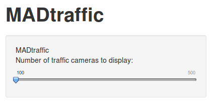

## MADtraffic app

The current version of MADtraffic app displays a number of traffic measure points of Madrid. You can click on each point and get some info on it.

---

## Data 1

Our dataset comes from the Madrid's council open data portal. It consists of more than 3,600 traffic measure points.

http://datos.madrid.es/

We need to manipulate the data before append it to our map, it's done in two functions:


```
getTrafficPoints <- function(limit = 0) {
  num_decimals <- 3
  # load traffic measure  points
  input_file <- paste(getwd(), '/data/PUNTOS_MEDIDA_TRAFICO_2014_01_23_FIXED.csv', sep='')
  l_traffic_measure_points <- read.csv2(input_file)
  df_traffic_measure_points <- as.data.frame(l_traffic_measure_points)
  df_traffic_measure_points$Long <- as.numeric(as.character(df_traffic_measure_points$Long))
  df_traffic_measure_points$Lat <- as.numeric(as.character(df_traffic_measure_points$Lat))
  df_traffic_measure_points$Long <- round(df_traffic_measure_points$Long, digits = num_decimals)
  df_traffic_measure_points$Lat <- round(df_traffic_measure_points$Lat, digits = num_decimals)
  
  if (limit == 0)
    return (df_traffic_measure_points)
  else
    return (df_traffic_measure_points[1:limit,])
}

```

---
## Data 2


```
getAirQualityPoints <- function() {
  num_decimals <- 3
  # load air quality measure points
  l_airq_measure_points <- read.csv2('data/est_airq_madrid.csv')
  df_airq_measure_points <- as.data.frame(l_airq_measure_points)
  df_airq_measure_points$Long2 <- as.numeric(as.character(df_airq_measure_points$Long2))
  df_airq_measure_points$Lat2 <- as.numeric(as.character(df_airq_measure_points$Lat2))
  df_airq_measure_points$Long2 <- round(df_airq_measure_points$Long2, digits = num_decimals)
  df_airq_measure_points$Lat2 <- round(df_airq_measure_points$Lat2, digits = num_decimals)
  return (df_airq_measure_points)
}


```


---

## Visualization

For the visualizaton we are using the <a href="https://github.com/ramnathv/rCharts/">RCharts</a> library, specifically the call that wraps the Leaflet javascript library under the hood.


Some snippets of visualization code that display our map:

```  
  #   create map
  map <- Leaflet$new()
  map$tileLayer(provide='Stamen.TonerLite')
  
  #   init map
  map$setView(c(40.41, -3.70), zoom = 12, size = c(20, 20))

  #   input data to map
  map$geoJson(
        leafletR::toGeoJSON(data_, 
                            dest=output_geofile)
  )

  ...

  # append markers and popup texts
  for(i in 1:num_measure_points) {
    html_text <- paste("<h6> Punto de medida del tráfico </h6>")
    html_text <- paste(html_text, "<p>",  df_traffic_measure_points$NOMBRE.C.254[i],"          </p>")
    map$marker(c(df_traffic_measure_points$Lat[i], 
                  df_traffic_measure_points$Long[i]), 
                bindPopup = html_text)
  }
  
  ...
  
  #   set properties and return
  map$enablePopover(TRUE)
  map$fullScreen(TRUE)
  return(map)
}
```

---

## Control

You can choose with the slider control the number of traffic measure points to display in the leaflet map.


