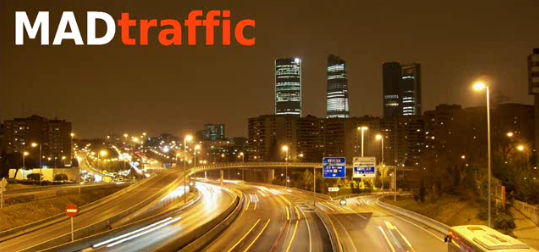
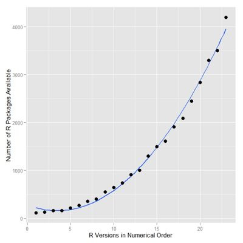

## Introducción

MADtraffic pretende ser una aplicación que aclare muchas dudas sobre la realidad del tráfico y la contaminación en nuestra ciudad.

---



## Fuentes de datos

- <a href="http://datune.maddata.es/dataset/trafico-intensidad-del-trafico-ubicacion-de-los-puntos-de-medida">Dataset puntos de medida del tráfico</a>
- <a href="http://datune.maddata.es/dataset/instrucciones-de-conexion-a-impala">Dataset intensidad del tráfico - RIMpala</a>
- <a href="">Dataset estaciones de calidad del aire</a>
- <a href="http://datune.maddata.es/dataset/calidad-del-aire-datos-horarios-anos-2003-a-2014">Dataset mediciones horarias de calidad del aire (2014)</a>

- http://datos.madrid.es/
- http://datune.maddata.es/

---

## Visualización

- RCharts - http://rcharts.io/
  - Mapa Leaflet - http://leafletjs.com/
  - MorrisJS - http://morrisjs.github.io/morris.js/
  - JQuery Datatable - http://www.datatables.net/
- ggplot/ggplot2 - http://ggplot2.org

---

## Otras fuentes de datos

* MeteoForecast - es un paquete de R que da acceso a modelos numéricos de predicción del tiempo a través de los siguientes servicios:
  - GFS
  - MeteoGalicia
  - OpenMeteo
  - NAM
  - RAP

* Openair - Open-source tools for air pollution data analysis - http://www.openair-project.org/
* European Air quality dataBase - http://acm.eionet.europa.eu/databases/airbase/ (<-2012)
* Big Open Api (BOA) - http://datune.maddata.es/home/developers.html

---

## R & Shiny pros


---
## Comunidad R




---

## Estadística

R fundamentalmente es:

* Estadística
* Machine learning
* Predicción
* etc

---

## Controles Shiny

Shiny ofrece una gran variedad de contoles de usuario


---
## Entonces, ¿Qué problemas podemos resolver?

- ¿Cuales son las calles más atascadas?
- ¿Cuándo se atascan?¿Con cuánto tráfico?
- ¿Cuánta contaminación genera?¿y dónde?
- ¿Si reducimos el tráfico reducimos la contaminación?
- ¿En qué calles habría que aumentar el transporte público?
- ¿y cuándo?
- ¿Cómo afecta el tiempo al tráfico?¿y cuánto?
- ¿Cómo podría afectar todo esto a la calidad de vida de los madrileños?

---
## Y ¿cómo los resolvemos?


```r
print(xtable(X[1:6,1:2]), type = "html")
```


---
### Tabla

```r
source("global_functions.R")
source("airq.R")
connectImpala()
data <- getTrafficSeriesChart(id_traf_point, input$day_selection, 0)

chart <- mPlot(x = 'fecha', 
               y = input$traf_variables, 
               type = 'Line',
               data = data)

chart$set(pointSize = 0, lineWidth = 1)    

chart

```

---

## Gracias

Miguel Fiandor & Jose Luis Alonso


